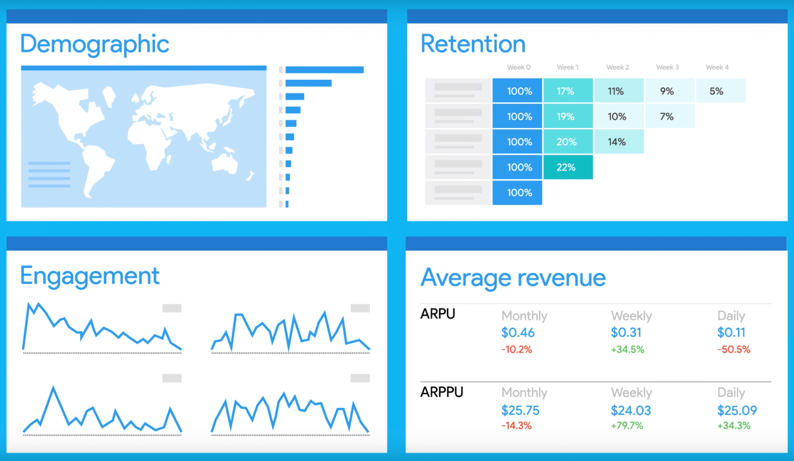
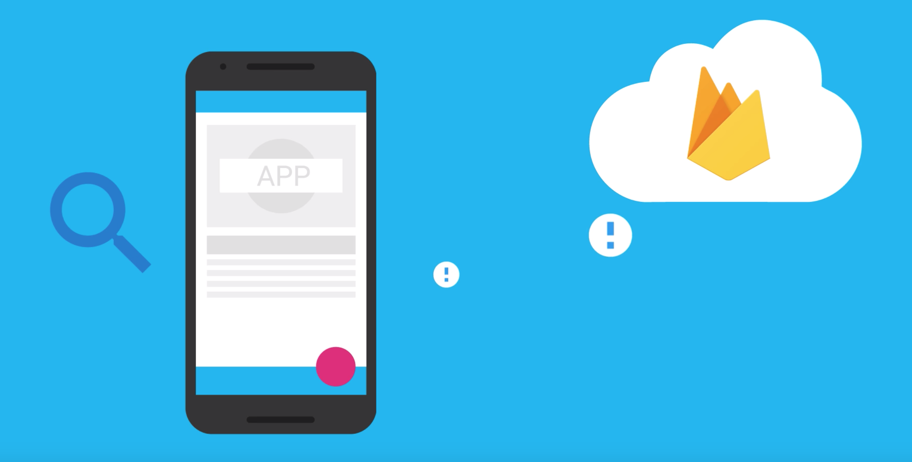
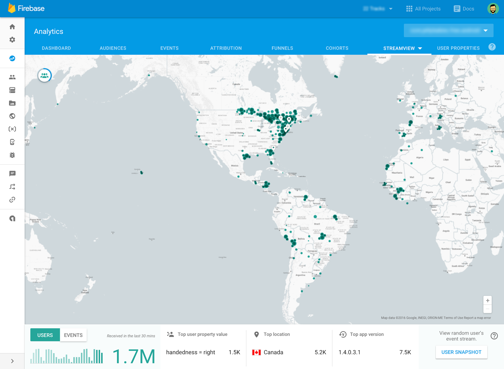

---

# Introduzione a Firebase

## Andrea Maglie

---

# Strumenti per l'analisi

---

# Firebase Analytics

* Free logging
* Free reporting

---

# Statistiche abilitate di default

<!--
 - Demografiche (caratteristiche degli utenti e come sono distribuiti)
 - Retention - per sapere con che regolarità gli utenti utilizzano l'app
 - Engagement - per sapere quanto tempo gli utenti trascorrono utilizzando l'app
 - Average ravenue -  statistiche su quanto gli utenti spendono nell'app (nel caso siano previste transazioni)
-->

---

# Tracciamento eventi personalizzati

<!--
 Come per Google Analytics, anche con Firebase Analytics è possibile tracciare eventi customizzati, come ad esempio:
 - click su determinati bottoni
 - completamento di particolari azioni (ad esempio "prenotazione di un tavolo" oppure "l'utente ha fatto un selfie e caricato l'immagine")
 - 
-->

---

# Tracciamento proprietà utenti personalizzati

<!--
 E' possibile definire proprietà custom per gli utenti, come ad esempio le tipologie di ristoranti preferiti
-->

---

# Creazione di audience personalizzate

<!--
 Il tracciamento delle proprietà custom è utile per definire delle "audience", ovvero dei gruppi di utenti.
 Questi gruppi possono essere utilizzati successivamente in altre funzionalità, come targent per notifiche push o per A/B Testing e utilizzare nuovamente Analytics per tracciare e misurare eventi specifici per i vari target.
-->

---

# Differenze tra Firebase Analytics e Google Analytics (1)

❌ Real-time View
✅ Stream View
❌ Behavior Flow
✅ Audience (➡️ Targeting delle notifiche push)
✅ Funnel basati su eventi
✅ Gratuito e illimitato (a parte le tipologia di eventi che possono essere al massimo 500)
✅ Alcuni eventi vengono visualizzati automaticamente (come avvio app, visualizzazione di Activity)
❌ Valori dei parametri limitati a 36 caratteri

<!--
Google Analytics e Firebase Analytics si differenziano su alcuni aspetti. L'aspetto più importante è che Firebase Analytics è più focalizzato sulle applicazioni mobile, mentre Google Analytics è più orientato al web.
In particolare in Firebase:
- non c'è una visualizzazione in realtime come Google Analytics
- le audience costituiscono un grande vantaggio, soprattuto quando vengono utilizzate insieme ad altre funzioni come le notifiche push o i crash reporting (utilizzando Firebase Crash Reporting viene creata automaticamente la audience degli utenti ai quali capita un crash dell'app)
- la creazione di un funnel è basata su eventi e non su visualizzazioni di schermate  
- Gratuito e illimitato, fatto salvo per il numero di tipologie di eventi che possono essere al massimo 500
- tracciamento automatico degli eventi più comuni in una app, come l'avvio o l'apertura di determinate activity
- I valori dei parametri associabili ad un evento sono limitati a 36 caratteri, il che limita la quantità e il livello di dettaglio delle informazioni che possono essere associate agli eventi
-->

---

--

# Differenze tra Firebase Analytics e Google Analytics (2)

## Google Analytics

* Metriche basate su utente o sessione
* Dati basati su sessioni, utenti, visualizzazioni

## Firebase Analytics

* Metriche basate su utente 
* Dati basati su eventi

<!--
- Con Google Analytics è possibile tracciare sia metriche basate sull'utente che sulla sessione, con Firebase prevalentemente metriche basate sull'utente
- Firebase misura tutto tramite eventi mentre in Google Analytics ci si può basare su sessioni, utenti e visualizzazioni di schermata
- Ad ogni evento in FA è possibile associare fino a 25 coppie chiave-valore, ma i parametri non sarano visibili di default; devono essere regisrati a mano nella console (con un limite di 50 parametri)
-->

---

# StreamView

<!--
- La Stream View permette di avere una visualizzazione "live" degli eventi degli ultimi 30 minuti.
- Di default la visualizzazione mostrata è la distribuzione geografica degli utenti (che hanno generato eventi negli ultimi 30 minuti).

-->

---
